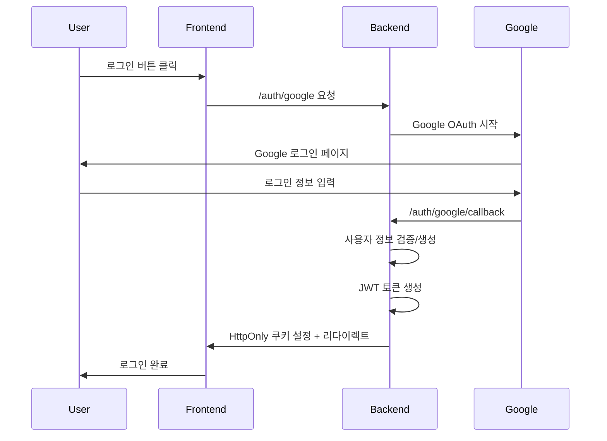
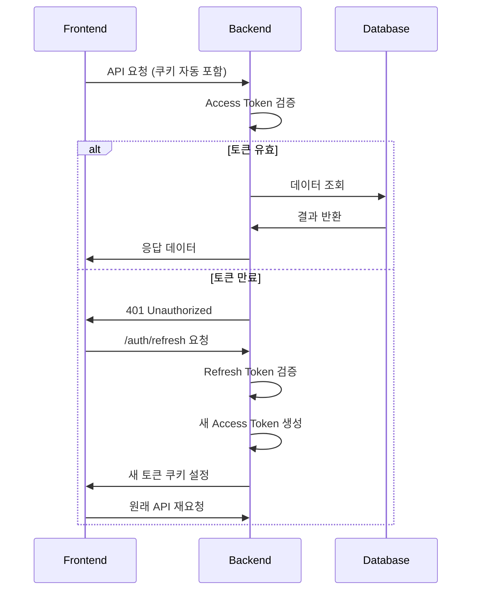

# TULOG 서비스 보안 인증 시스템

## 📋 개요

TULOG는 **JWT 토큰 + HttpOnly 쿠키**를 결합한 하이브리드 인증 방식을 사용합니다.
이는 JWT의 확장성과 쿠키의 보안성을 동시에 활용하는 현대적인 접근법입니다.

## 🔐 인증 방식 선택 이유

### 기존 방식들의 한계

-   **순수 JWT (localStorage)**: XSS 공격에 취약
-   **세션 기반**: 서버 확장성 문제, 메모리 사용량 증가
-   **순수 쿠키**: CSRF 공격 위험

### 우리의 해결책

**JWT 토큰을 HttpOnly 쿠키에 저장**하여 두 방식의 장점을 결합

## 🏗️ 시스템 구조

### 1. 토큰 종류 및 역할

| 토큰 종류         | 만료 시간 | 저장 위치     | 역할              |
| ----------------- | --------- | ------------- | ----------------- |
| **Access Token**  | 15분      | HttpOnly 쿠키 | API 요청 인증     |
| **Refresh Token** | 30일      | HttpOnly 쿠키 | Access Token 갱신 |

### 2. 토큰 구조

```typescript
// Access Token Payload
{
  sub: number,        // 사용자 ID
  email: string,      // 사용자 이메일
  type: 'access',     // 토큰 타입
  iat: number,        // 발급 시간
  exp: number         // 만료 시간
}

// Refresh Token Payload
{
  sub: number,        // 사용자 ID
  type: 'refresh',    // 토큰 타입
  iat: number,        // 발급 시간
  exp: number         // 만료 시간
}
```

## 🔄 인증 플로우

### 1. 로그인 과정



### 2. API 요청 과정



## 🛡️ 보안 메커니즘

### 1. HttpOnly 쿠키 설정

```typescript
// 쿠키 보안 설정
res.cookie("accessToken", accessToken, {
    httpOnly: true, // XSS 공격 방어
    secure: true, // HTTPS에서만 전송
    sameSite: "strict", // CSRF 공격 방어
    maxAge: 15 * 60 * 1000, // 15분 만료
});
```

### 2. 보안 속성 설명

| 속성                 | 역할                   | 방어하는 공격                     |
| -------------------- | ---------------------- | --------------------------------- |
| `httpOnly: true`     | JavaScript 접근 차단   | XSS (Cross-Site Scripting)        |
| `secure: true`       | HTTPS에서만 전송       | 중간자 공격 (MITM)                |
| `sameSite: 'strict'` | 동일 사이트에서만 전송 | CSRF (Cross-Site Request Forgery) |

### 3. 토큰 로테이션 (Token Rotation)

```typescript
// 토큰 갱신 시 새로운 Refresh Token도 함께 발급
async refreshToken() {
  // 1. 기존 Refresh Token 검증
  // 2. 새 Access Token 생성
  // 3. 새 Refresh Token 생성 (로테이션)
  // 4. 기존 Refresh Token 무효화
  // 5. 새 토큰들을 쿠키에 설정
}
```

**로테이션의 보안 효과:**

-   토큰 탈취 시 피해 최소화
-   비정상적인 토큰 사용 패턴 감지 가능
-   장기간 토큰 사용 방지

## 🔒 추가 보안 기능

### 1. Rate Limiting

```typescript
@UseGuards(RateLimitGuard)
// 동일 IP에서 과도한 요청 차단
```

### 2. 토큰 블랙리스트 (구현 예정)

```typescript
// 로그아웃 시 토큰 무효화
// 의심스러운 활동 감지 시 토큰 강제 만료
```

### 3. 다중 기기 세션 관리 (구현 예정)

```typescript
// 기기별 토큰 관리
// 원격 로그아웃 기능
```

## 🎯 자동 토큰 갱신

### Frontend 자동 갱신 메커니즘

```typescript
// 14분마다 자동 토큰 갱신 (15분 만료 1분 전)
const refreshInterval = setInterval(async () => {
    await api.auth.refresh();
}, 14 * 60 * 1000);
```

**장점:**

-   사용자 경험 향상 (재로그인 불필요)
-   세션 연속성 보장
-   보안성 유지 (짧은 토큰 만료 시간)

## 📊 보안 비교

| 인증 방식          | XSS 방어 | CSRF 방어 | 확장성 | 구현 복잡도 |
| ------------------ | -------- | --------- | ------ | ----------- |
| **우리 방식**      | ✅       | ✅        | ✅     | 중간        |
| JWT (localStorage) | ❌       | ✅        | ✅     | 낮음        |
| 세션 기반          | ✅       | ⚠️        | ❌     | 낮음        |
| 순수 쿠키          | ✅       | ❌        | ❌     | 낮음        |

## 🚀 향후 보안 강화 계획

### 단기 목표

-   [ ] 토큰 로테이션 구현
-   [ ] 토큰 블랙리스트 시스템
-   [ ] 로그인 시도 제한

## 🔍 모니터링 및 로깅

### 보안 이벤트 로깅

```typescript
// 로그인 시도, 토큰 갱신, 실패한 인증 등
// 보안 감사를 위한 상세 로그 기록
```

### 성능 모니터링

-   토큰 갱신 빈도 추적
-   인증 실패율 모니터링
-   응답 시간 최적화

## 💡 개발자 가이드

### 인증이 필요한 API 호출

```typescript
// Frontend에서 API 호출 시 자동으로 쿠키 포함
const response = await fetch("/api/protected", {
    credentials: "include", // 쿠키 자동 전송
});
```

### 토큰 상태 확인

```typescript
// 토큰 만료 시 자동 갱신 또는 로그인 페이지로 리다이렉트
if (response.status === 401) {
    await refreshToken();
    // 또는 로그인 페이지로 이동
}
```
